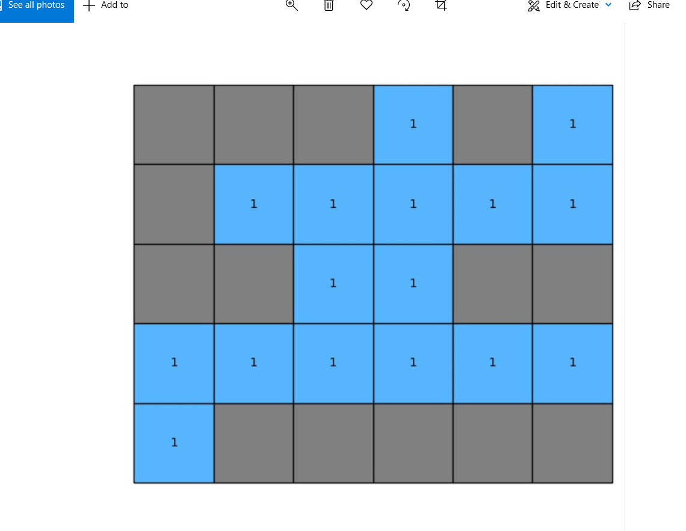

# Programming for counting number of lakes Readme file

Author: Fangjian Lei

Date: 2021-3-22

## Introduction
Given a matrix where 0 represents water and 1 represents land, count the number of lakes in it. A lake is surrounded by lands and is formed by connecting adjacent water horizontally or vertically or diagonally. Generally, I utilized the DFS, 2-D list, dynamic programming, and Python matplot libaray to fullfill this task.

### Example: 
An example matrix and its visual representation are shown as below. There
are a total of 3 lakes in the matrix. They are marked with numbers 1-3 in the figure.


## Instruction

Starting with typing the following command into terminal
```
python count_of_lake.py
```
Then it will ask you to enter the number of rows and number of columns.


Console will ask you keep entering entries rowwise that users only allow to enter 1 or 0


Finally, you will get the answer in console and output images depicting the correct answer. It is worthy to say that the output answer will saved in the same directory with you code. Of Course, the image will pop up automatically when the program is running.




